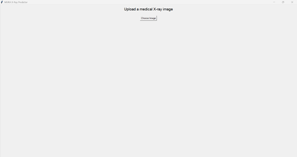
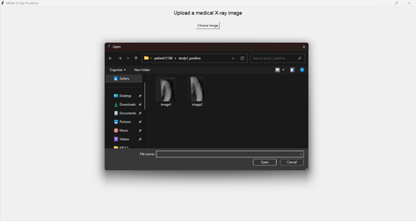
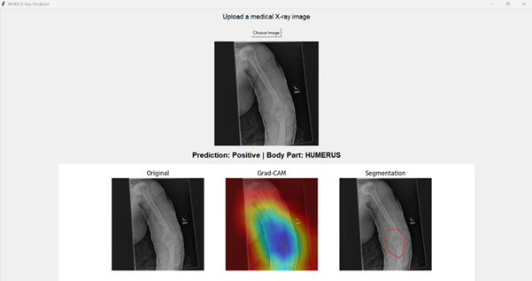
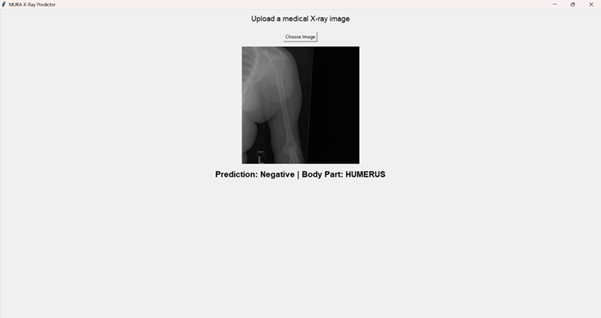

# 🦴 BoneInsight

**BoneInsight** is a deep learning project that detects and localizes musculoskeletal abnormalities from radiographs using the **MURA dataset**.  
It uses **DenseNet121** for classification and **Grad-CAM** for explainable visualization of affected regions.

---

## 🖥️Screenshots




   


## 🔍 Overview

BoneInsight classifies whether a patient’s radiograph shows any abnormality and highlights the affected region using Grad-CAM-based heatmaps.  
This project is part of ongoing medical AI research aimed at improving explainable diagnosis from X-rays.

---

## ⚙️ Features

- 🧠 **DenseNet121** backbone trained on the MURA dataset  
- 🔥 **Grad-CAM visualization** for explainable AI-based segmentation  
- 🖥️ **Simple GUI interface** for easy use  
- 📈 **Trained model** (`mura_densenet121.pth`) ready for inference  
- 🧩 **Future work:** Grad-CAM++, Vision Transformers, and advanced segmentation

---

## 🧰 Installation

```bash
# Clone the repository
git clone https://github.com/<your-username>/BoneInsight.git](https://github.com/AnantVishwakarma2002/BoneInsight.git
cd BoneInsight

# Install dependencies
pip install torch torchvision numpy opencv-python pillow matplotlib

```

---


##🚀 Usage

Keep both GUI.py and mura_densenet121.pth in the same folder.

1. Run the GUI:
```bash
python GUI.py
```
2. Upload your radiograph through the interface.

3. The model will:

- Classify the image as Normal or Abnormal

- Generate a Grad-CAM heatmap to visualize the region of concern

---
